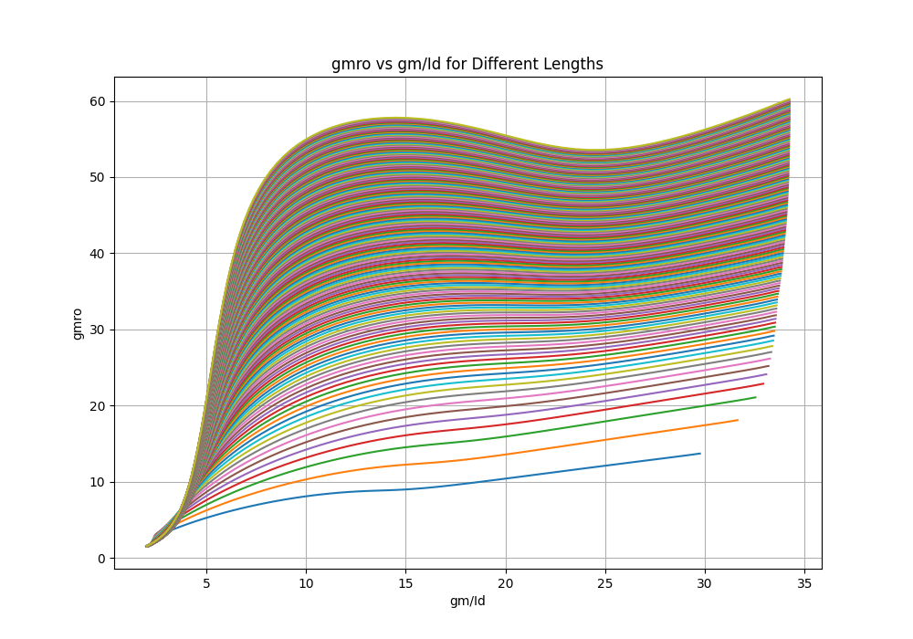
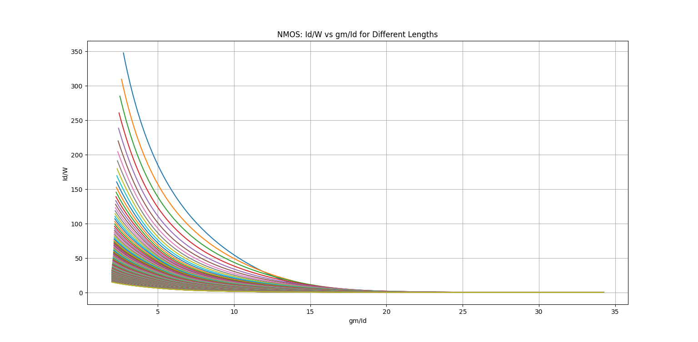
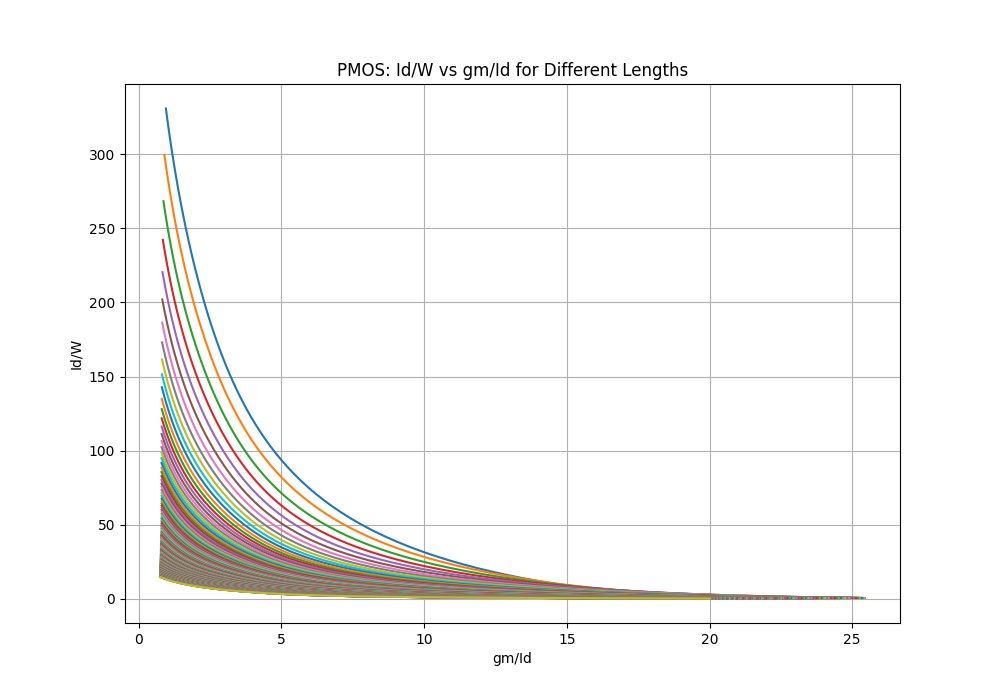
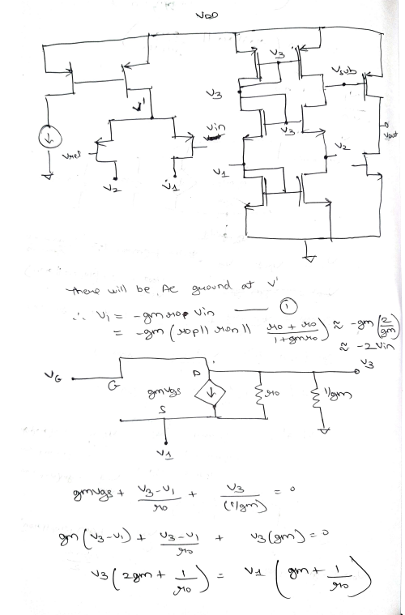
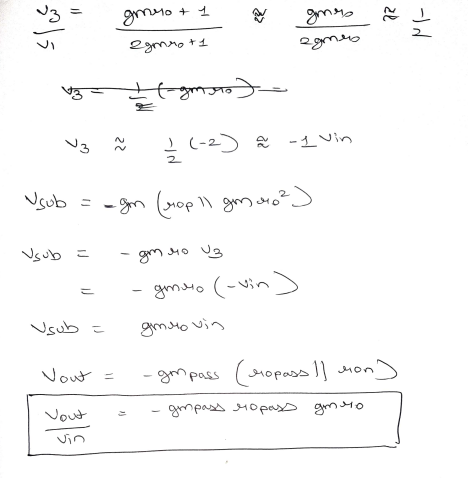

# Self-biased-LDO

## Literature Survey

| **Paper Title**                                                                 | **What Have They Done**                                                                                           | **How Have They Done It**                                                                                                                                    | **Technology Node** |
|---------------------------------------------------------------------------------|------------------------------------------------------------------------------------------------------------------|-------------------------------------------------------------------------------------------------------------------------------------------------------------|---------------------|
| **Adaptively Biased Output Cap-Less NMOS LDO With 19 ns Settling Time**         | No external capacitor, fast settling NMOS LDO with adaptively biased error amplifier to increase loop bandwidth and slew rate by 100%.                  | Dynamically increases the bias current of the error amplifier (EA) during load transients using a sensing mechanism that mirrors a portion of the load current. | 180 nm              |
| **High Stability Adaptive LDO using Dynamic Load Sensing for Low Power Management of Wireless Sensor Networks** | Dynamic mechanism providing low/high bias current to the error amplifier as the load current decreases/increases.                                        | LDO adapts from a 2-stage configuration at light loads to a 3-stage configuration at high loads for a more current-efficient system.                          | 65nm       |
| **An Adaptively Biased LDO Regulator with 11nA Quiescent Current and 50mA Available Load** | Capacitor-less LDO with series-series positive feedback for adaptive biasing. Ultra-low quiescent current (11 nA) with a load capacity of up to 50 mA.  | Positive feedback bias current regulation ensures proportional bias current to load current. Includes current cancellation, startup circuitry, and stability features. | 180 nm              |
| **An ULP and Very Efficient Adaptively Biased LDO Regulator for Harvesting Application** | LDO regulator with adaptive biasing that adjusts quiescent current based on load current for high efficiency over 1 μA to 3 mA load range.              | FVF cells replace constant-current sources in the error amplifier, improving the slew rate without requiring a high fixed bias current.                        | 130nm      |
| **Design of an Adaptively Biased Low-Dropout Regulator With a Current Reusing Current-Mode OTA Using an Intuitive Analysis Method** | Proposed a current reusing current-mode OTA (CRCM-OTA) for use in adaptively biased LDOs (AB-LDOs).                                                      | Introduced a CRCM-OTA for AB-LDO, modified from the current-mode OTA (CM-OTA).                                                                               | 180nm      |

# Design of an Adaptive LDO circuitry for Low-Power IoT Applications

### Choice of Technology Node:- Gpdk045

Advantages:-
We are moving towards lower technology nodes and the main aim of this process was to tapeout which will possibly happen in UMC_65 node and thus to experience similar expects I have chosen this node.

Disadvantages:-
The other technology nodes like gpdk090,gpdk180 give more gain for similar values of lengths for a gm/Id of 10. Thus we can design the LDO for a significantly lesser value of gain for a similar length for other nodes.

### Specifications ( Constraints )

Since we are designing this circuit for low power IOT applications the biggest challenge is to use the minimum amount of resources to meet the constraints.

- Rail voltage:- 1.2V
- Overdrive:- Varied from 100mV to 200mV ( as gm/Id varies ).
- Iq:- Since we are developing an adaptive circuitry the biasing current should change according to the applied load and based on it we have found out a range for which the device will operate for a particular gm/Id.
- Loop Gain :- 60db
- Closed Loop PSRR :- -60db
- Load current variation:- 1mA - 100mA
- Regulated output:- 0.6V

### Design Challenges:-

- Headroom:- We are working with limited headroom ( Supply voltage = 1.2V ) which is supposed to maintain all the transistors in saturation in order to get a loop gain of 60db.
- Selection of overdrive voltage:- Since we are working with limited headroom we need to select the overdrive voltage such that all transistors are in saturation.
- Area:- Ideally we would want our chip as small as possible. In order to eliminate the headroom problem we would design the LDO for minimum overdrive which is the highest possible value of gm/Id but due to this we will design the circuit for a significantly higher width which will increase the Area of the circuit.
- Topology Selection:- Due to the above three parameters we need to select a topology which would meet all the required constraints.
- Techplot generation:- Since we are working with lower gain we need to sweep the values accordingly for a large range of lengths so that we can get lengths for which we get a gain of 50.
- Selection of gain for each block:- We need to select the gain values for each block in such a way that we can design the other blocks in the loop as all the blocks in the loop are dependent of one another.

### Circuit Diagram:-

### Topology Selection:-

I have chosen the folded cascode configuration in the design.

- We are regulating a voltage of 0.6 volts. This voltage if applied to the gate of an NMOS transistor may drive it into regions other than saturation.
- We are also working with less headroom and the folded cascode configuration will save an overdrive of Vov over other topologies.

### Square Law vs gm/Id methodology

| Square law -based Approach | Techplot-based Approach |
|-------------------------|-------------------------|
| As the length of the technology node decreases, the standard equation of `gm/Id = 2/Vov` is not valid and instead it follows a linear relation. **Thus**, we can’t apply square law for lower nm technology nodes. | While making **techplots**, we ask the tool to calculate the individual values of `gm/Id`, `gmro`, `ft`, and `Id/w` at different values of length instead of depending on the equation, and thus we get the exact curve which incorporates the short channel effects. |
| Design will **take time** more for lower technology nodes as second-order effects come in picture. | Design will comparatively take less time as we can have a script to design the entire topology. |
| More accurate as exact values are considered. | **Can** be less accurate if the dataset taken to plot **techplots** is of less resolution. |

### Why gm/Id over square Law

- I am using the gm/Id method to size the transistors as I was working with relaxed constraints and the speed to design the circuits is comparitively faster for gm/Id methodology.
- Most importantly as I am working with 45nm technology node short channel effects can come in the picture which will be taken care by the gm/Id methodology.

### Results for different overdrive voltages

- For gm/Id = 10,

The PMOS current mirror near the rail voltage goes in linear region as we are providing very less headroom to the device.

From the curve we can see that as vov increases gm/Id decreases. So for gm/Id = 10 we get a higher value of overdrive. In this case we can't bias our device as the current mirror in our device is not in saturation and it won't be able to bias the LDO with the required quoiscent current.

From the above simulation we can see that the transistor PM3 is in triode region of operation.

- For gm/Id = 15,

### PSRR and Saturation Current Range (Designed for 50µA)

| Iload | PSRR (in dB) | Iq (range for which circuit is in saturation designed for 50µA) |
|-------|-------------|--------------------------------------------------|
| 100m  | -60.8      | 6µ - 55µ                                         |
| 10m   | -55.3      | 6µ - 55µ                                         |
| 1m    | -46.49     | 6µ - 55µ                                         |

---

### PSRR and Saturation Current Range (Designed for 5µA)

| Iload | PSRR (in dB) | Iq (range for which circuit is in saturation designed for 5µA) |
|-------|-------------|--------------------------------------------------|
| 100m  | -53        | 0.4µ - 6µ                                        |
| 10m   | -57        | 0.4µ - 6µ                                        |
| 1m    | -54        | 0.4µ - 6µ                                        |

The operating point summary is as follows:-

- For gm/Id = 17,

### PSRR and Saturation Current Range (Designed for 50µA)

| Iload | PSRR (in dB) | Iq (range for which circuit is in saturation designed for 50µA) |
|-------|-------------|--------------------------------------------------|
| 100m  | -70        | 13µ - 72.5µ                                      |
| 10m   | -59.63     | 13µ - 72.5µ                                      |
| 1m    | -43.6      | 13µ - 72.5µ                                      |

---

### PSRR and Saturation Current Range (Designed for 5µA)

| Iload | PSRR (in dB) | Iq (range for which circuit is in saturation designed for 5µA) |
|-------|-------------|--------------------------------------------------|
| 100m  | -50        | 1µ - 6µ                                          |
| 10m   | -68.5      | 1µ - 6µ                                          |
| 1m    | -56.6      | 1µ - 6µ                                          |

- For gm/Id = 20,

The Passfet goes in the subthreshold region of operation. Thus we don't get proper functionality of the circuit and we observe a lesser gain.

## Tradeoffs observed:-

- As gm/Id increases Id/w decreases and thus the passfet size increases to approx 20m for a load of 100mA.
- On the contrary if we decrease the gm/Id then passfet size decreases but the overdrive will increase which puts the PMOS M3 goes in triode region of operation.

### Algorithm

- Since we are designing for a loop gain of 1000 or 60db we need to make sure that we can incorporate the gain within the two blocks in the loop which are the OTA block and the passfet block.
- We start by sizing the passfet. We start designing by taking the least length from the techplots as we want to minimize the area of the passfet. We then calculate the gain for the OTA from the techplots. If this gain is more than the values present in the techplots, we need to redesign the passfet in such a way that the OTA gain is within the reach of the techplots.
For example if we take the least length for the passfet its gain will be less than 20 for PMOS and thus we won't be able to get the corresponding design for the NMOS in the OTA as we don't have those values in our techplots.

- After finding the ideal length for the passfet we now have to find the width from the Id/w plots for the designed gain. Since we already have fixed the length in the previous step we can find the corresponding Id/w and get the value of w from Id/( Id/w ) expression.
- Repeat the last step till you design the entire OTA and the passfet.
- Once we get the appropriate widths and lengths for the passfet and the OTA we move on to the current mirror circuit. We desingn the current mirror circuit for the maximum possible length in our techplots which in my case is 4050nm in order to eliminate the Vds mismatch in the design.

- We then get the Id/w for the NMOS and the PMOS current mirror circuit and from there we will get the desired widths following which we have designed the entired Folded cascode LDO.

##### Remember:- Make sure to take the correct values of current as it gets divided in the OTA.

### Small signal model

- ## Can we operate a FET in the saturation region of operation with a high Vds across it?
  Yes we can operate a FET with a high Vds in the saturation region of operation. However in the current design as the PMOS source voltage increases/decreases the Vsg will change and thus the device will go from subthreshold to saturation or vice versa. Similar operation is observed for NMOS.

- ## Why does the bottom PMOS get a higher VDS when stacked in series?

  

Since the drop across the bottom pmos is the highest the corresponding rout is highest for that mosfet so irrespective of how many mosfets we are adding in series the mosfet at the bottom should have the highest resistance as the Vds across it is the highest.

  
  
  

## Original circuit analysis

#### The loop gain is as follows:-

#### The sizing is as follows:-

The resistance across the mosfets are as follows:-

  
  
  
  

## For series connection of mosfets

### Schematic:-

### Loop gain

### Sizing 

### PMOS in OTA

#### Schematic

The resistance in each pmosfet is as follows:-

  
  
  

### NMOS in OTA

Schematic:-

The resistance in each nmosfet is as follows:-

  
  
  

### NMOS recycled path

#### Schematic

The resistance for the mosfet is as follows:-

## Modified Original Circuit

Schematic

#### The loop gain is as follows:-

#### The sizing is as follows:-

The resistance across the mosfets are as follows:-

  
  
  
  

### Conclusion

By adding a recycled path the overall resistance of the NMOS side increases significantly. The Iq drops to 10nA. There is a 3rd path for the AC analysis. The overall loop gain increases which is a combined result of all these reasons and also the regulation is better.

## Modified 3 stage circuit with added recycled path

Schematic

## Loop gain

## Sizing

## For PMOS

Schematic

The resistance is as follows:-

## For NMOS

Schematic

The resistance is as follows:-

## For Both recycled paths

Schematic

The resistance is as follows:-

  
  

## Conclusion

The regulation has got better. The loop gain is better. The output resistance increases significantly. The Iq reduces significantly. However the initial theory holds true that the resistance across the series stages is not uniform where there is a significant drop across 1 transistor who has a higher resistance than the rest. The ultimate conclusion being that connecting the mosfets in series is not reducing the current in the mosfets by a significant margin but it is the recycled self biased addition that is able to reduce the current in the OTA as well as provide an additional recycled path which thereby increases the overall gain of the OTA from 50db to 55db.

# Total self biased circuit without methodology

## Schematic

## Loop gain

## PSRR

## Sizing

### For PMOS OTA

Schematic

The resistance is as follows

  
  

### For NMOS OTA and recycled path

Schematic

The resistance is as follows

  
  
  

### Conclusion

In the initial design I was getting a gain of gmro so instead of that I have tried cascoding the circuit to get a gain of (gmro)^2 from the circuit. Also in order to reduce the Iq I have added another recycled stage in the bottom. With the current sizing the recycled stage is not contributing to the gain but is rather acting as a stage which reduces the overall Iq of the design and thus the overall resistance of the n side FETs increases which further takes the gain of the overall OTA towards (gmro)^2. If I try to further cascode the PMOS stages then the resistance of individual FETS goes in G ohms range which dominates the Mohms range of the NMOS. In order to counter this we will need to add further stages in the NMOS side. Also the resistance of the NMOS side reduces at the junction of the folded cascode as the resistance at that point is (res of recycled NMOS || res of folded PMOS || res of NMOS and PMOS ) which reduces the overall n side resistance. So we would need to add further stages on the NMOS side or cascode the folded PMOS side further to increase the looking down resistance at the OTA output. The overall Iq is 4nA and the PSRR is -47db for a loop gain of 56db. 

# Cascaded Self bias circuit without methodology ( Golden Creation )

## Schematic

## Loop gain

## PSRR

## Sizing

## Conclusion

The stability is gone. Sizing needs to be fixed. PSRR improved slightly. High mismatch is observed. As discussed I tried connecting the current mirror in the main OTA to eliminate the AC noise but that wont happen as the OTA is assymetric and thus there wont be a AC 0 point at the drain of PMOS current mirror ( if connected near source of PM26/ PM27 ). Also cascading is able to give a decent gain of 113db but there is introduction of zeros as seen in the phase plot. I have removed the additional recycled path in the design as it takes away the symmetricity of the OTA thus leading to more mismatch. Final conclusion is that in order to get the best PSRR out of this design it needs to be symmetric. Following gm/id will surely reduce the lengths and increase the widths of the design so the overall Iq of the design will increase.

# Multi-Stage Cascading and its effects on stability ( With Methodology )

## 3-Stage Cascading

### Schematic

### Loop gain

### PSRR

### Sizing

### Poles and Zeros in the System

2 RHP zeros near 0 freq and 1 far away.

## 4 stage Cascading

### Schematic

### Loop gain

### PSRR

### Sizing

### Poles and Zeros 

### Conclusion

As we keep on adding stages the number of RHP zeros keep on increasing and since we are operating at low Iq we are seeing multiple poles and zeros at low frequencies. So the methodology needs to be designed around poles keeping ft in mind and not gmro.

### My Octagon

The differemt terms which come under my octagon are

Area
Power (Iq)
Transient Response
Gain
PSRR
Regulation
Stability
Corner Simulations

# Stable System with Methodology

## Schematic

## Loop gain and phase

## Total Iq with varying load

## Regulated Output with varying load

## PSRR

The system is stable for all the different values of load current with minimum phase margin as 54 degrees and it increases as the load current keeps on increasing.

## Conclusion

The low Iq in the main OTA is achieved methodically but the values obtained using gm/Id methodology suggest values of width which are not supported by the PDK thus we go for the least possible width and its corresponding length. Thus when we try to see the gmoverid in the dcop post simulations we get different value to which we have designed it for. The second recycled NMOS pair contributes more towards a decrease in the Iq in its branch. It does not make any significant contribution towards increase in the overall gain of the circuit. 

## Future work

- The nmos recycled part does not seem to be sized properly according to the methodology. Need help in that part.
- Need to tie this circuit to an application.

# Recycled path analysis

## Original circuit

Schematic

Gain

## Gain without recycled path

Schematic

Gain

## With no diode connect

Schematic

Gain

## With only the recycled path

Schematic

Gain

## Conclusion

- Case 1:- We are getting a gain of 37db
- Case 2:- We are getting similar gain of 37db but with the introduction of an external source can introduce noise in the circuit.
- Case 3:- We are getting a reduced gain when there is no diode connect.
- Case 4:- When we only have the recycled path in the circuit we are getting a better loop gain than Case 3 which indicates the importance of the recycled path.

# What are Wake up Radio Systems

A wake-up radio system typically consists of a low-power receiver (WuRx), a main radio, and a wake-up call transmitter (WuTx). The WuRx constantly monitors for a specific signal, the WuC, from the WuTx, which can be the node's main radio. Upon detecting the WuC, the WuRx triggers a signal to wake up the main radio, enabling it to communicate.

## 🔋 Power Consumption of WuRx in Key Applications

| Application Domain        | Typical WuRx Power | Notes |
|---------------------------|--------------------|-------|
| **Wireless Sensor Networks (WSN)** | **100 nW – 10 µW** | For event-driven wake-up in environmental/industrial sensing |
| **Internet of Things (IoT)**       | **200 nW – 20 µW** | Used in smart home/city devices; lower when always listening |
| **Medical Devices**                | **10 nW – 1 µW**   | Especially low-power for implantables or skin-contact devices |
| **RFID & Asset Tracking**          | **1 µW – 10 µW**   | May use passive WuRx for triggered ID/response |
| **Security/Surveillance**         | **10 µW – 50 µW**  | Higher performance needed for fast detection, moderate latency |
| **Energy Harvesting Systems**      | **100 nW – 5 µW**  | Tight power budget; WuRx must operate near or below harvested power |
| **Consumer Electronics**           | **10 µW – 100 µW** | Voice wake-up or gesture recognition needs slightly more power |

## Feedback factor:- ( less than 1 and greater than 1)

For feedback factor less than 1 

- EA can be designed to handle lesser swing ( portion of the output voltage ) and thus there will be lesser load on the EA for the same output swing.
- Loop gain and the PSRR will be lesser.

For Feedback factor greater than 1 

This will lead to a positive feedback.

## Comparison with reference paper

| **Parameter**              | **This Work**              | **Random Value**         |
|---------------------------|----------------------------|--------------------------|
| Technology                | 180 nm                     | 45 nm                   |
| Capacitor-less            | yes                        | yes                      |
| Size (µm²)                | 4310                       | 5120                    |
| VIN (V)                   | 0.6                        | 1                     |
| VOUT (V)                  | 0.5                        | 0.6                     |
| IQ (nA)                   | 6.99                       | 3.88                    |
| IL max (mA)               | 0.75                       | 1                    |
| LS (mV/V)                 | 3.18                       |                     |
| LR (mV/mA)                | 4.77                       | 5.32                     |
| PSR @ 10 Hz (dB)          | -22.5 @ 0 A -17 @ 500 µA | -41 @ 100uA  -33 @ 500 µA |
| PSR @ 10 kHz (dB)         | -24 @ 0 A 0 @ 500 µA     | -25 @ 100uA  -23 @ 500 µA  |

## SCL 180-nm process

### Paper published by IIITB Students

https://ieeexplore.ieee.org/document/9190288/

### Design to tapeout tutorial for SCL 180nm

https://arxiv.org/pdf/1908.10674 ( written by Prof Joydeep Basu who was Gourab's Professor at Jadavpur under whom he ( Gourab ) has written a paper. So we can reach out to him for further details through Gourab )

### IISC research on ESD for SCL 180nm

https://www.indiascienceandtechnology.gov.in/research/high-voltage-esd-device-development-enablement-scl-180nm-cmos-technology

### E-fabless

https://github.com/efabless/caravel?tab=readme-ov-file#analog-user-project

### ISCAS papers ( class tapeout )

They have summarised the entire coursework in the paper and have mentioned how they have integrated digital and analog classes and have taped out chips throughout a semester.

- https://ieeexplore.ieee.org/stamp/stamp.jsp?tp=&arnumber=8351506
- https://ieeexplore.ieee.org/stamp/stamp.jsp?tp=&arnumber=10558297
- https://ieeexplore.ieee.org/stamp/stamp.jsp?tp=&arnumber=10558544

