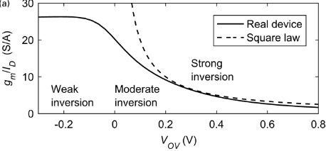
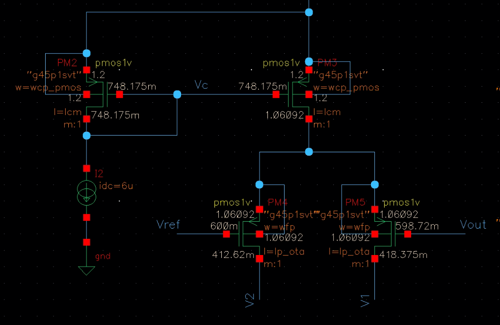
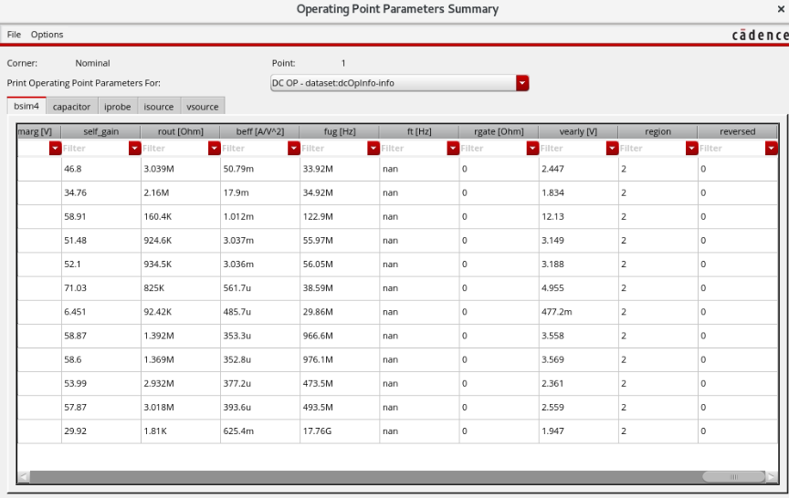
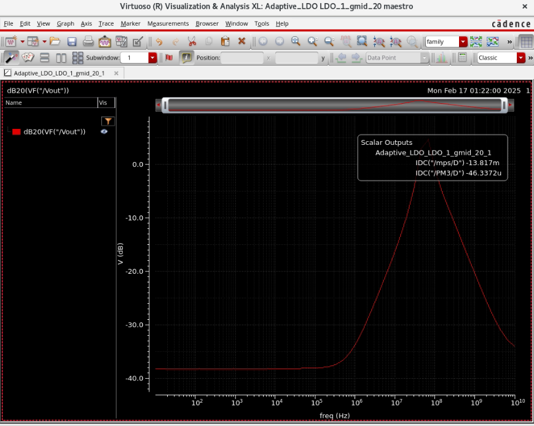
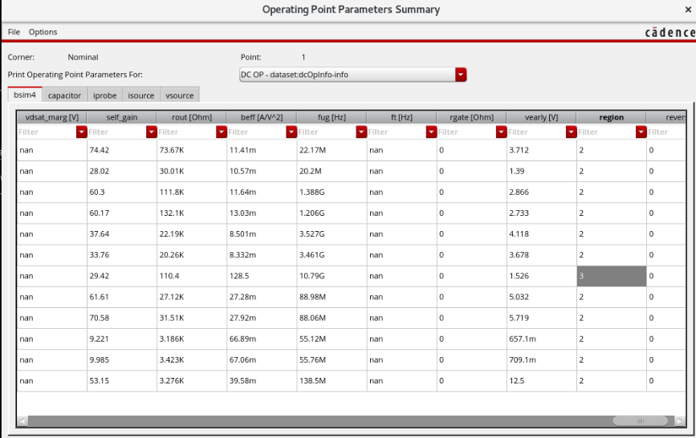

# Self-biased-LDO

## Literature Survey

| **Paper Title**                                                                 | **What Have They Done**                                                                                           | **How Have They Done It**                                                                                                                                    | **Technology Node** |
|---------------------------------------------------------------------------------|------------------------------------------------------------------------------------------------------------------|-------------------------------------------------------------------------------------------------------------------------------------------------------------|---------------------|
| **Adaptively Biased Output Cap-Less NMOS LDO With 19 ns Settling Time**         | No external capacitor, fast settling NMOS LDO with adaptively biased error amplifier to increase loop bandwidth and slew rate by 100%.                  | Dynamically increases the bias current of the error amplifier (EA) during load transients using a sensing mechanism that mirrors a portion of the load current. | 180 nm              |
| **High Stability Adaptive LDO using Dynamic Load Sensing for Low Power Management of Wireless Sensor Networks** | Dynamic mechanism providing low/high bias current to the error amplifier as the load current decreases/increases.                                        | LDO adapts from a 2-stage configuration at light loads to a 3-stage configuration at high loads for a more current-efficient system.                          | 65nm       |
| **An Adaptively Biased LDO Regulator with 11nA Quiescent Current and 50mA Available Load** | Capacitor-less LDO with series-series positive feedback for adaptive biasing. Ultra-low quiescent current (11 nA) with a load capacity of up to 50 mA.  | Positive feedback bias current regulation ensures proportional bias current to load current. Includes current cancellation, startup circuitry, and stability features. | 180 nm              |
| **An ULP and Very Efficient Adaptively Biased LDO Regulator for Harvesting Application** | LDO regulator with adaptive biasing that adjusts quiescent current based on load current for high efficiency over 1 μA to 3 mA load range.              | FVF cells replace constant-current sources in the error amplifier, improving the slew rate without requiring a high fixed bias current.                        | 130nm      |
| **Design of an Adaptively Biased Low-Dropout Regulator With a Current Reusing Current-Mode OTA Using an Intuitive Analysis Method** | Proposed a current reusing current-mode OTA (CRCM-OTA) for use in adaptively biased LDOs (AB-LDOs).                                                      | Introduced a CRCM-OTA for AB-LDO, modified from the current-mode OTA (CM-OTA).                                                                               | 180nm      |

# Design of an Adaptive LDO circuitry for Low-Power IoT Applications

### Choice of Technology Node:- Gpdk045

Advantages:-
We are moving towards lower technology nodes and the main aim of this process was to tapeout which will possibly happen in UMC_65 node and thus to experience similar expects I have chosen this node.

Disadvantages:-
The other technology nodes like gpdk090,gpdk180 give more gain for similar values of lengths for a gm/Id of 10. Thus we can design the LDO for a significantly lesser value of gain for a similar length for other nodes.

### Specifications ( Constraints )

Since we are designing this circuit for low power IOT applications the biggest challenge is to use the minimum amount of resources to meet the constraints.

- Rail voltage:- 1.2V
- Overdrive:- Varied from 100mV to 200mV ( as gm/Id varies ).
- Iq:- Since we are developing an adaptive circuitry the biasing current should change according to the applied load and based on it we have found out a range for which the device will operate for a particular gm/Id.
- Loop Gain :- 60db
- Closed Loop PSRR :- -60db
- Load current variation:- 1mA - 100mA
- Regulated output:- 0.6V

### Design Challenges:-

- Headroom:- We are working with limited headroom ( Supply voltage = 1.2V ) which is supposed to maintain all the transistors in saturation in order to get a loop gain of 60db.
- Selection of overdrive voltage:- Since we are working with limited headroom we need to select the overdrive voltage such that all transistors are in saturation.
- Area:- Ideally we would want our chip as small as possible. In order to eliminate the headroom problem we would design the LDO for minimum overdrive which is the highest possible value of gm/Id but due to this we will design the circuit for a significantly higher width which will increase the Area of the circuit.
- Topology Selection:- Due to the above three parameters we need to select a topology which would meet all the required constraints.
- Techplot generation:- Since we are working with lower gain we need to sweep the values accordingly for a large range of lengths so that we can get lengths for which we get a gain of 50.
- Selection of gain for each block:- We need to select the gain values for each block in such a way that we can design the other blocks in the loop as all the blocks in the loop are dependent of one another.

### Circuit Diagram:-

### Topology Selection:-

I have chosen the folded cascode configuration in the design.

- We are regulating a voltage of 0.6 volts. This voltage if applied to the gate of an NMOS transistor may drive it into regions other than saturation.
- We are also working with less headroom and the folded cascode configuration will save an overdrive of Vov over other topologies.

### Square Law vs gm/Id methodology

| Square law -based Approach | Techplot-based Approach |
|-------------------------|-------------------------|
| As the length of the technology node decreases, the standard equation of `gm/Id = 2/Vov` is not valid and instead it follows a linear relation. **Thus**, we can’t apply square law for lower nm technology nodes. | While making **techplots**, we ask the tool to calculate the individual values of `gm/Id`, `gmro`, `ft`, and `Id/w` at different values of length instead of depending on the equation, and thus we get the exact curve which incorporates the short channel effects. |
| Design will **take time** more for lower technology nodes as second-order effects come in picture. | Design will comparatively take less time as we can have a script to design the entire topology. |
| More accurate as exact values are considered. | **Can** be less accurate if the dataset taken to plot **techplots** is of less resolution. |

### Why gm/Id over square Law

- I am using the gm/Id method to size the transistors as I was working with relaxed constraints and the speed to design the circuits is comparitively faster for gm/Id methodology.
- Most importantly as I am working with 45nm technology node short channel effects can come in the picture which will be taken care by the gm/Id methodology.

### Results for different overdrive voltages

- For gm/Id = 10,

The PMOS current mirror near the rail voltage goes in linear region as we are providing very less headroom to the device.

From the curve we can see that as vov increases gm/Id decreases. So for gm/Id = 10 we get a higher value of overdrive. In this case we can't bias our device as the current mirror in our device is not in saturation and it won't be able to bias the LDO with the required quoiscent current.

From the above simulation we can see that the transistor PM3 is in triode region of operation.

- For gm/Id = 15,

### PSRR and Saturation Current Range (Designed for 50µA)

| Iload | PSRR (in dB) | Iq (range for which circuit is in saturation designed for 50µA) |
|-------|-------------|--------------------------------------------------|
| 100m  | -60.8      | 6µ - 55µ                                         |
| 10m   | -55.3      | 6µ - 55µ                                         |
| 1m    | -46.49     | 6µ - 55µ                                         |

---

### PSRR and Saturation Current Range (Designed for 5µA)

| Iload | PSRR (in dB) | Iq (range for which circuit is in saturation designed for 5µA) |
|-------|-------------|--------------------------------------------------|
| 100m  | -53        | 0.4µ - 6µ                                        |
| 10m   | -57        | 0.4µ - 6µ                                        |
| 1m    | -54        | 0.4µ - 6µ                                        |

The operating point summary is as follows:-

- For gm/Id = 17,

### PSRR and Saturation Current Range (Designed for 50µA)

| Iload | PSRR (in dB) | Iq (range for which circuit is in saturation designed for 50µA) |
|-------|-------------|--------------------------------------------------|
| 100m  | -70        | 13µ - 72.5µ                                      |
| 10m   | -59.63     | 13µ - 72.5µ                                      |
| 1m    | -43.6      | 13µ - 72.5µ                                      |

---

### PSRR and Saturation Current Range (Designed for 5µA)

| Iload | PSRR (in dB) | Iq (range for which circuit is in saturation designed for 5µA) |
|-------|-------------|--------------------------------------------------|
| 100m  | -50        | 1µ - 6µ                                          |
| 10m   | -68.5      | 1µ - 6µ                                          |
| 1m    | -56.6      | 1µ - 6µ                                          |

- For gm/Id = 20,

The Passfet goes in the subthreshold region of operation. Thus we don't get proper functionality of the circuit and we observe a lesser gain.

## Tradeoffs observed:-

- As gm/Id increases Id/w decreases and thus the passfet size increases to approx 20m for a load of 100mA.
- On the contrary if we decrease the gm/Id then passfet size decreases but the overdrive will increase which puts the PMOS M3 goes in triode region of operation.

### Algorithm

- Since we are designing for a loop gain of 1000 or 60db we need to make sure that we can incorporate the gain within the two blocks in the loop which are the OTA block and the passfet block.
- We start by sizing the passfet. We start designing by taking the least length from the techplots as we want to minimize the area of the passfet. We then calculate the gain for the OTA from the techplots. If this gain is more than the values present in the techplots, we need to redesign the passfet in such a way that the OTA gain is within the reach of the techplots.

### Small signal model

### Octagon

